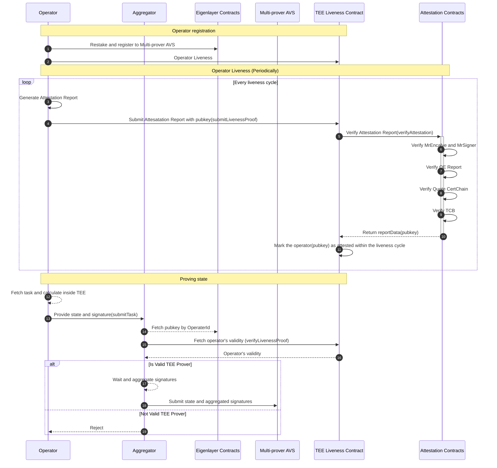

## Table of Contents
- [Table of Contents](#table-of-contents)
- [About Multi-Prover AVS](#about-multi-prover-avs)
- [Directory Structure](#directory-structure)
- [AVS Task Description](#avs-task-description)
- [AVS Architecture](#avs-architecture)
- [AVS Workflow](#avs-workflow)
- [TEE Committee and Quorum](#tee-committee-and-quorum)
- [Deployments](#deployments)
  - [Holesky Testnet Deployments](#holesky-testnet-deployments)
  - [Mainnet Deployment](#mainnet-deployment)
- [Compile From Source](#compile-from-source)
  - [Operator](#operator)
  - [Aggregator](#aggregator)

## About Multi-Prover AVS
The Automata Multi-Prover AVS target to build a robust, fortified prover system through the use of diverse, decentralized TEE committees.


Read this [blog](https://atanetwork.notion.site/Multi-Prover-AVS-with-TEE-545319c42885489196142d966f0ede86) to understand more about the Multi-Prover AVS.

## Directory Structure
<pre>
├── <a href="./contracts/">contracts</a>: Solidity contracts, including the AVS contracts and the attestation layer contracts.
│ ├── <a href="./contracts/dcap-v3-attestation/">dcap-v3-attestation</a>: On-chain verification library for Dcap attestation of Intel SGX.
│ ├── <a href="./contracts/src/">src</a>: Source files for AVS contracts.
│ └── <a href="./contracts/test/">test</a>: Tests for smart contracts.
├── <a href="./operator/">operator</a>: The operator implementation.
├── <a href="./aggregator/">aggregator</a>: The aggregator implementation.
├── <a href="https://github.com/automata-network/sgx-prover/tree/avs">sgx-prover</a>: the sgx version of TEE prover.
</pre>

## AVS Task Description
Task definition: A state transition or computational process seeking to leverage the independent execution within a Trusted Execution Environment (TEE) to ascertain its correctness.

```solidity
struct StateHeader {
    uint256 identifier;
    bytes metadata;
    bytes state;
}
```
This is the structure of the state header submitted ty provers, below is the detailed explaination:
- **identifier**: identifier of the handled task, it can be used to distinguish different kinds of tasks and used to calculator the contribution of each operators
- **metadata**: metadata that describe the specific task, for example `keccak256(abi.encodePacked(chainID, blockNumber))` is the metadata for the task to prove blockchain state at specific block height
- **state**: the final state produced by the TEE prover, it can be either a root state of blockchain, or statement proved by a zk circuit

## AVS Architecture
The architecture of the AVS contains:
- [Eigenlayer core contracts](https://github.com/Layr-Labs/eigenlayer-contracts)
- AVS contracts
    - ServiceManager which allow operators to submit tasks, reward and slash logic will be added in the future
- Attestation contracts
    - Manage the register/deregister and livenness of various TEE provers, it will verify attestation of different TEE platforms such as Intel SGX, AMD SEV, ARM TrustZone and so on
    - TEEProverRegister is the interface for the attestation layer used by the operators and aggregator
- Aggregator
    - Aggregate the BLS signatures from operators and submit the aggregated state to AVS
    - Interact with the Automata attestation layer to check the validity of each prover(operator), those who failed to pass the attestation verification or liveness challenge will be rejected to handle tasks until they are valid again.
- Operator
    - Fetch state proofs from TEE prover and submit it to the aggregator
- TEE prover
    - TEE prover that prove the final state of a given task, for example, a prover of zk-rollup L2 will execute blocks inside TEE and produce the root state at specific block

## AVS Workflow
Below is a detailed diagram of the workflow



Components:
- [Operator](./operator)
- [Aggregator](./aggregator)
- [MultiProver AVS](./contracts/src/core/MultiProverServiceManager.sol)
- [TEE Liveness Contract](./contracts/src/core/TEELivenessVerifier.sol)
- [Attestation Contract](https://github.com/automata-network/sgx-prover/blob/avs/verifier/contracts/AutomataDcapV3Attestation.sol)

The workflow is divided into two parts:
- Setup
    - Follow the [Eigenlayer's doc](https://docs.eigenlayer.xyz/eigenlayer/overview) to stake and register as operator of Multi-prover AVS
    - Generate attestation and register as TEE prover, attestation and its generating process differs depending on the TEE technology. For example, [dcap-v3-attestation](./contracts/dcap-v3-attestation/) is the contracts of verifying Dcap attestation of Intel SGX
- Working
    - Except what operators should do to handle tasks, they must complete liveness challenge periodically, otherwise they will be treated as invalid and their submission will be rejected by the aggregator
    - Operators fetch new task and finish the calculation inside TEE
    - Operators sign the final state and send it together with signature to aggregator
    - Aggregator will fetch operator's validity before accepting its submission
    - Aggregator aggregate all the BLS signature and submit to the AVS service manager

## TEE Committee and Quorum


**TEE Committee** is a set of quorum that is responsible to handle a specific type of task. For example, proving the root state of Zk-Rollup at a particular block height. Operators do not need to actively choose a committee, but automatically belong to a committee by joining quorums. The introduction of `TEE Committee` facilitates a more organized structuring of operators and tasks. And lays the groundwork for future enhancements, including the rewarding mechanism and constraints of stake distribution across quorums.

The concept of a **TEE Quorum** aligns with the quorum definition utilized by Eigenlayer, but each quorum is associated with a TEE platform, such as Intel SGX. Each quorum belongs to a committee, operators can choose to join any quorum, But only the votes from operators possessing the requisite attestation will be accepted by the aggregator.

## Deployments
### Holesky Testnet Deployments
| Name                      | Proxy                                                                                                                           |
| ------------------------- | ------------------------------------------------------------------------------------------------------------------------------- |
| MultiProverServiceManager | [`0x4665Af665df5703445645D243f0FD63eD3b9D132`](https://holesky.etherscan.io/address/0x4665Af665df5703445645D243f0FD63eD3b9D132) |
| RegistryCoordinator       | [`0x62c715575cE3Ad7C5a43aA325b881c70564f2215`](https://holesky.etherscan.io/address/0x62c715575cE3Ad7C5a43aA325b881c70564f2215) |
| StakeRegistry             | [`0x5C7BbAfA3d5A3Fa0b592cDCF4b7B52261FaA99A8`](https://holesky.etherscan.io/address/0x5C7BbAfA3d5A3Fa0b592cDCF4b7B52261FaA99A8) |
| BlsApkRegistry            | [`0x2b6C2584760eDbcEC42391862f97dBB872b5e2Eb`](https://holesky.etherscan.io/address/0x2b6C2584760eDbcEC42391862f97dBB872b5e2Eb) |
| IndexRegistry             | [`0x158583f023ca440e79F199f037aa8b53b198F500`](https://holesky.etherscan.io/address/0x158583f023ca440e79F199f037aa8b53b198F500) |
| OperatorStateRetriever    | [`0xbfd43ac0a19c843e44491c3207ea13914818E214`](https://holesky.etherscan.io/address/0xbfd43ac0a19c843e44491c3207ea13914818E214) |
| TEELivenessVerifier       | [`0x2E8628F6000Ef85dea615af6Da4Fd6dF4fD149e6`](https://holesky.etherscan.io/address/0x2E8628F6000Ef85dea615af6Da4Fd6dF4fD149e6) |
| AutomataDcapV3Attestation | [`0x5669FE82711052e1A0EE16eafCDAb49ffe02ab14`](https://holesky.etherscan.io/address/0x5669FE82711052e1A0EE16eafCDAb49ffe02ab14) |

Please visit the [Operator setup](https://github.com/automata-network/multiprover-avs-operator-setup) repository if you are interested in joining the Multi-Prover AVS on Holesky testnet. The onboarding guide is available [here](https://github.com/automata-network/multiprover-avs-operator-setup/tree/main/holesky).

### Mainnet Deployment
| Name                       | Proxy                                                                                                                              |
| -------------------------- | ---------------------------------------------------------------------------------------------------------------------------------- |
| MultiProverServiceManager  | [`0xE5445838C475A2980e6a88054ff1514230b83aEb`](https://etherscan.io/address/0xE5445838C475A2980e6a88054ff1514230b83aEb)            |
| RegistryCoordinator        | [`0x414696E4F7f06273973E89bfD3499e8666D63Bd4`](https://etherscan.io/address/0x414696E4F7f06273973E89bfD3499e8666D63Bd4)            |
| StakeRegistry              | [`0x4A4EC1631aE79699be7dCFD3fCA395Ab89c5eFe9`](https://etherscan.io/address/0x4A4EC1631aE79699be7dCFD3fCA395Ab89c5eFe9)            |
| BlsApkRegistry             | [`0x61D25c9b943b893747Bd33F92B62Ec8270222e6F`](https://etherscan.io/address/0x61D25c9b943b893747Bd33F92B62Ec8270222e6F)            |
| IndexRegistry              | [`0x16552d7863560Ee6903F092A901A9124a5013085`](https://etherscan.io/address/0x16552d7863560Ee6903F092A901A9124a5013085)            |
| OperatorStateRetriever     | [`0x91246253d3Bff9Ae19065A90dC3AB6e09EefD2B6`](https://etherscan.io/address/0x91246253d3Bff9Ae19065A90dC3AB6e09EefD2B6)            |
| Optimism Attestation Layer | [`0x8E26055388347A2f4A7a112A7210CcC88A1c2F30`](https://optimistic.etherscan.io/address/0x8E26055388347A2f4A7a112A7210CcC88A1c2F30) |
| Automata Attestation Layer | [`0x2c674af4C9B6DE266E4515Be0E2A9C1c30452026`](https://explorer.ata.network/address/0x2c674af4C9B6DE266E4515Be0E2A9C1c30452026)    |

Please visit the [Operator setup](https://github.com/automata-network/multiprover-avs-operator-setup) repository if you are interested in joining the Multi-Prover AVS on Ethereum mainnet. The onboarding guide is available [here](https://github.com/automata-network/multiprover-avs-operator-setup/tree/main/mainnet).

## Compile From Source

### Operator

```
go build -o out/operator ./cmd/operator
```

### Aggregator

```
go build -o out/aggregator ./cmd/aggregator
```
